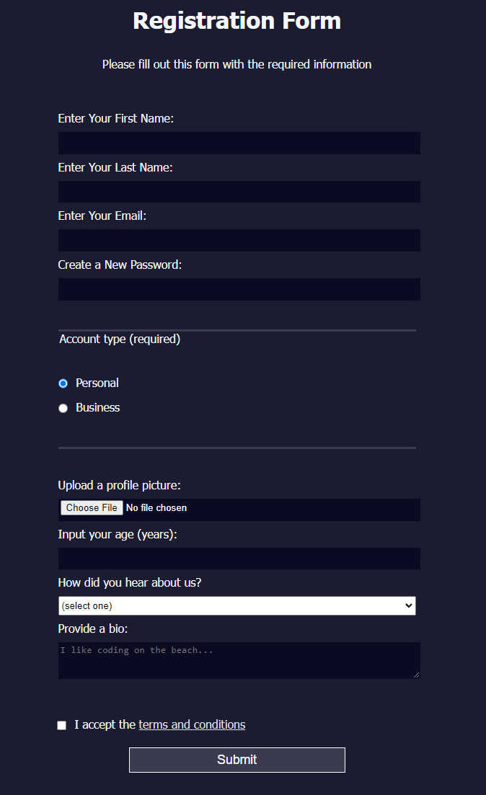

# In building this one, I learned:
1. about the form tag, that it has a method and an action
2. that it's a best practice to name inputs
3. password fields' input can be restricted to pass certain regular expression checks through pattern attribute
4. legends(captions for fieldsets) look really good on said fieldsets
5. options nested in a selection must have a value
6. elements can be selected through both their types and whether they are last of their kind
7. viewport height is a unit
8. stuff can be set to "unset" so they don't get affected by other settings that affect them 

  

